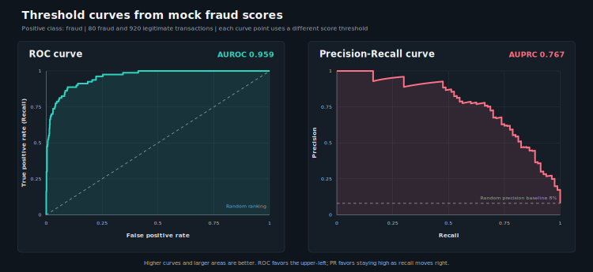

# Spark ML and pandas Scaling Exam Guide

**What this is for:** the complete Spark ML study guide for the Databricks Machine Learning Professional objectives scheduled across July 13-15. It combines the exact official-document reading scope with the model, metric, tuning, scoring, and pandas-scaling knowledge you need to answer exam scenarios.

**Last checked:** July 16, 2026 against the live September 2025 exam guide and current Apache Spark and Databricks documentation.

---

## 1. Exam scope and target

The official exam outline expects you to:

1. Decide when Spark ML is appropriate.
2. Construct a pipeline and distinguish Estimators from Transformers.
3. Select an appropriate feature stage and model family.
4. Tune and evaluate a Spark ML model.
5. Score a fitted model in batch or Structured Streaming.
6. Choose Spark ML or a single-node model for batch, streaming, or real-time inference.
7. Scale group-specific training and inference with pandas Function APIs and pandas UDFs.

This guide covers those Spark-related objectives. It does **not** replace the later MLflow, Feature Store, monitoring, MLOps, or Model Serving guides.

The exam is more likely to ask for the best choice in a production scenario than to ask you to derive an algorithm. Understand the definitions, trade-offs, parameter effects, and API shapes. You do not need to memorize algorithm derivations or the entire Spark estimator catalog.

---

## 2. July 14: models, evaluators, tuning, and inference

### July 14 reading scope

This guide repeats a few earlier concepts so it can serve as a self-contained revision reference. That does **not** mean you should reread their source pages on July 14.

**Already completed - do not reread today:**

| Completed | Source | Why it still appears in this guide |
|---|---|---|
| July 10 | [Official exam guide](https://www.databricks.com/sites/default/files/2025-10/databricks-certified-machine-learning-professional-exam-guide-september.pdf) | It defines the Spark ML objectives this guide must cover |
| July 13 | [MLlib on Databricks](https://docs.databricks.com/aws/en/machine-learning/train-model/mllib/) | The Spark-versus-single-node decision is a prerequisite for July 14 |
| July 13 | [Spark ML pipelines](https://spark.apache.org/docs/latest/ml-pipeline.html) | Estimators, Transformers, and Pipelines are needed for tuning |
| July 13 | [Spark feature catalog](https://spark.apache.org/docs/latest/ml-features.html) | The required feature stages are summarized here for model-selection scenarios |

**Read on July 14:**

| Priority | Source | Read | Skip |
|---|---|---|---|
| REFERENCE | [Classification and regression catalog](https://spark.apache.org/docs/latest/ml-classification-regression.html) | Opening description of Logistic/Linear Regression, Decision Tree, Random Forest, GBT, and Naive Bayes when a model choice is unclear | Formulas and repeated Scala/Java/R examples |
| MUST | [Evaluation metrics concepts](https://spark.apache.org/docs/latest/mllib-evaluation-metrics.html) | Classification introduction, confusion-matrix terms, binary metric definitions, and regression metric meanings | All `pyspark.mllib` RDD code; the exam plan uses the DataFrame-based `pyspark.ml` API |
| MUST | [ML tuning](https://spark.apache.org/docs/latest/ml-tuning.html) | Model selection, Cross-Validation, Train-Validation Split, and the Python examples | Repeated Scala and Java examples |
| SKIM | [Databricks ML capabilities](https://docs.databricks.com/aws/en/machine-learning/concepts/ml-capabilities) | Batch inference versus real-time serving | GenAI-specific product detail |
| REFERENCE | [Log Loss](https://scikit-learn.org/stable/modules/generated/sklearn.metrics.log_loss.html) | Definition, inputs, and direction | Formula derivation and full parameter reference |

### When Spark ML is the right choice

A **single-node model** is trained or run on one machine using that machine's CPU and memory; Spark can still distribute separate models or model copies across multiple workers.
Examples include scikit-learn, non-Spark XGBoost, pandas-based libraries, and TensorFlow or PyTorch running on one machine.

| Situation | Best first choice | Why |
|---|---|---|
| Training data and preprocessing are already large Spark DataFrames | Spark ML | Distributed transformations and supported estimators remain in Spark |
| The dataset cannot fit on one machine and a supported Spark estimator fits the use case | Spark ML | Training and transformation are distributed across the cluster |
| The fitted Spark pipeline must score a large batch table or stream | Spark `PipelineModel.transform()` | The same preprocessing and model stages run on distributed DataFrames |
| Data and model fit comfortably on one machine | scikit-learn or another single-node library | Simpler development and a broader algorithm ecosystem may be preferable |
| Each store or customer needs its own independently trained single-node model | `groupBy().applyInPandas()` | Spark distributes the groups while each worker trains a local model |
| Custom model code must add one prediction per row to a huge Spark DataFrame | pandas UDF | Spark performs vectorized column scoring in distributed Arrow batches |
| Custom model code must process Spark data as pandas DataFrame batches | `mapInPandas()` | Each worker receives and returns an iterator of pandas DataFrames using an explicit output schema |
| A model already logged in MLflow must score a huge Spark DataFrame | `mlflow.pyfunc.spark_udf()` | The model URI is converted directly into a distributed Spark UDF |
| Individual low-latency requests need predictions | Model Serving | Real-time request/response is a serving problem, not a Spark batch job |

Do not choose Spark ML merely because the platform is Databricks. The deciding factors are data size, model support, required inference mode, and whether distributed DataFrame execution is useful.

### Spark ML object model

```text
Estimator   --fit(DataFrame)------> Transformer
Transformer --transform(DataFrame)-> DataFrame

Pipeline (Estimator) --fit()------> PipelineModel (Transformer)
```

| Object | Meaning | Examples |
|---|---|---|
| `Estimator` | Learns state from data and implements `fit()` | `StringIndexer`, `OneHotEncoder`, `StandardScaler`, `LogisticRegression`, `Pipeline` |
| `Transformer` | Applies an already-defined or learned transformation with `transform()` | `VectorAssembler`, fitted feature models, fitted prediction models, `PipelineModel` |
| `Param` | A named configurable setting owned by an Estimator or Transformer | `lr.regParam`, `tree.maxDepth` |
| `ParamMap` | One set of parameter values passed to fitting/evaluation | One combination created by `ParamGridBuilder` |

A fitted model such as `LogisticRegressionModel` is a Transformer because it adds prediction columns. `Pipeline.fit()` fits Estimator stages in order and produces a `PipelineModel`; `PipelineModel.transform()` runs the fitted stages in order.

### Required feature stages

```text
StringIndexer (Estimator)      --fit()------> StringIndexerModel
OneHotEncoder (Estimator)      --fit()------> OneHotEncoderModel
StandardScaler (Estimator)     --fit()------> StandardScalerModel
VectorAssembler (Transformer)  --transform()-> one features vector
```

| Stage | Job | Key exam distinction |
|---|---|---|
| `StringIndexer` | Convert string categories or labels to numeric indices | Learns category ordering, so it must be fitted |
| `OneHotEncoder` | Convert category indices to sparse indicator vectors | Expects numeric category indices, so use it after `StringIndexer`; for linear models, this prevents categories from appearing ordinal |
| `VectorAssembler` | Combine numeric and vector columns into one `features` vector | It does not encode strings and requires no fitting |
| `StandardScaler` | Learn means/standard deviations and scale vector features | Often useful for linear or distance-based methods; trees do not require scaling |

Put learned preprocessing inside the Pipeline being tuned. Otherwise preprocessing can be fitted outside the validation folds and leak information into validation data.

### Start model selection with the target

```text
Categorical label             -> classification
Continuous numeric label      -> regression
No label; discover groups     -> clustering (recognize only here)
Rank items for each user      -> ranking/recommendation (recognize only here)
```

For this exam block, know the following classification and regression families in useful detail. You do not need to learn every algorithm listed in the Spark catalog.

### Model-family comparison

| Model | Target | Best fit | Main strength | Main limitation |
|---|---|---|---|---|
| Logistic Regression | Binary or multiclass category | Roughly linear class boundary; probability/confidence needed | Fast, interpretable coefficients, regularization | Misses nonlinear interactions unless features express them |
| Linear Regression | Continuous number | Roughly linear additive relationship | Fast, interpretable coefficients | Sensitive to nonlinear structure and large outliers with squared loss |
| Decision Tree | Category or continuous number | Threshold rules and feature interactions | Nonlinear, interpretable, no feature scaling | A single deep tree overfits and has high variance |
| Random Forest | Category or continuous number | Strong nonlinear baseline with stable predictions | Reduces variance by averaging/voting many randomized trees | Larger and less interpretable than one tree |
| GBT | Binary category or continuous number | High predictive accuracy from sequential trees | Corrects earlier errors and captures nonlinear structure | Sequential, slower, and more sensitive to tuning/overfitting |
| Naive Bayes | Category | Sparse counts, text, or simple probabilistic features | Very fast and effective for high-dimensional sparse data | Conditional-independence assumption misses interactions |

### Logistic Regression

`LogisticRegression` predicts class probabilities/confidences and converts them to a categorical prediction using a threshold. Spark supports binomial and multinomial logistic regression.

Choose it when:

- The target is categorical.
- A linear decision boundary is plausible.
- Coefficients, probability scores, or fast distributed training matter.

Know these parameters:

| Parameter | Effect |
|---|---|
| `regParam` | Overall regularization strength; increasing it shrinks coefficients and can reduce overfitting |
| `elasticNetParam` | Mix of L2 and L1 regularization: `0.0` is L2, `1.0` is L1, values between mix both |
| `maxIter` | Maximum optimization iterations |
| `threshold` | Binary classification: one class-1 probability cutoff, default `0.5`; lowering it predicts more positives, while raising it predicts fewer |
| `thresholds` | Usually multiclass/multinomial: one positive value per class; Spark predicts the class with the largest `probability / threshold`, so lowering one class's value favors that class. A two-value array is also valid for binary classification |
| `family` | `binomial`, `multinomial`, or `auto`; `auto` selects from the number of classes, so using multiclass `thresholds` does not require explicitly setting `family="multinomial"` |

For binary classification, `threshold=p` is equivalent to `thresholds=[1-p, p]`. Do not normally set both; if both appear in a parameter map, they must be equivalent. Threshold settings change decisions, precision, and recall, but do not retrain the model or change its underlying ranking scores. More regularization is not automatically better: too much can underfit.

These regularization rules apply to both Spark `LogisticRegression` and `LinearRegression`:

```text
regParam        -> how much regularization
elasticNetParam -> which kind: 0 = L2, 1 = L1

L1 penalty -> sum of absolute coefficient values: sum(abs(coefficient))
           -> some coefficients can become zero -> sparse model / feature selection
L2 penalty -> sum of squared coefficient values: sum(coefficient^2)
           -> coefficients become smaller but usually remain nonzero
```

### Linear Regression

`LinearRegression` predicts a continuous numeric value as a linear combination of features.

Choose it when:

- The target is continuous, such as revenue, duration, or demand.
- A roughly linear additive relationship is plausible.
- Coefficient interpretation matters.

High-value parameters are `regParam`, `elasticNetParam`, `maxIter`, and `loss`. Spark supports squared error and Huber loss; Huber is less dominated by large residuals. L1 regularization can drive some coefficients to zero, while L2 shrinks them without usually making them exactly zero.

### Decision Tree

A Decision Tree recursively splits the feature space using threshold rules. Spark has separate classifier and regressor Estimators.

Choose it when nonlinear rules, interactions, or easy-to-explain decisions matter. Trees do not require feature standardization.

Spark trees support continuous and indexed categorical features:

#### Continuous features

A continuous feature is a measured number whose ordering is meaningful, such as age or income. A tree can split it at an ordered cutoff such as `age <= 35`. Spark bins continuous values to create candidate split points.

#### Indexed categorical features

A categorical feature represents distinct groups, such as `region = east/west/north`. Spark models require numeric features, so `StringIndexer` converts the strings to indices such as `east -> 0`, `west -> 1`, and `north -> 2`. Those numbers are identifiers: category `2` is not greater than category `1`.

The index alone is not enough because the `features` vector contains only numbers. `StringIndexer` or `VectorIndexer` attaches hidden **categorical metadata**, and `VectorAssembler` carries it into the assembled vector. The metadata tells the tree that a vector position contains categories, allowing category-based splits instead of treating the indices as a continuous measurement. One-hot encoding is usually unnecessary for Spark trees.

For example, a categorical split can send indices `{0, 2}` left and `{1}` right based on set membership; it does not have to use an ordered cutoff such as `index <= 1`.

`featuresCol="features"` only names the vector column, while `labelCol="label"` only names the target column. Neither parameter is the metadata. You can inspect the vector metadata with `df.schema["features"].metadata`; you do not need to memorize its JSON structure. Without categorical metadata, manually created numeric category IDs can be treated as continuous values.

#### Why `maxBins` must cover category cardinality

**Cardinality** is the number of distinct categories. `maxBins` controls how many bins Spark may use when evaluating feature splits, and it must be at least as large as the category count of every categorical feature.

```text
Largest categorical feature: region with 50 categories
maxBins=32                       -> too small
maxBins=50 or greater            -> valid
```

The default is `32`. Increasing it supports higher-cardinality features and gives continuous features more candidate split granularity, but it also increases computation and memory use.

```text
featuresCol -> where the feature vector is
metadata    -> what each vector position means
maxBins     -> must cover the largest categorical feature's category count
```

Know these parameters:

| Parameter | Effect |
|---|---|
| `maxDepth` | Deeper trees learn more complex rules but increase compute and overfitting risk |
| `maxBins` | Controls split candidates; must be at least the number of categories for a categorical feature |
| `minInstancesPerNode` | Minimum rows required in each child after a split; raising it prevents tiny leaves |
| `minInfoGain` | Minimum improvement required to accept a split; raising it makes splitting harder |
| `impurity` | Measures split quality; a classifier uses `"gini"` or `"entropy"`, while a regressor uses `"variance"` |

### Random Forest

A Random Forest trains many randomized trees using bootstrapped rows and feature subsets, then votes for classification or averages for regression. The trees can be trained more independently than GBT trees.

Choose it for a strong, stable nonlinear baseline when one tree is too variable. More trees generally improve stability but increase training, storage, and inference cost.

Know these parameters:

| Parameter | Type | Effect |
|---|---|---|
| `numTrees` | Integer | Number of independent trees in the ensemble |
| `featureSubsetStrategy` | String | Controls which feature columns are considered at each split, such as `"sqrt"`, `"all"`, `"0.5"`, or `"10"` |
| `subsamplingRate` | Float | Controls the fraction of training rows used for each tree, such as `0.8` for about 80% of the rows |
| `maxDepth`, `maxBins`, node constraints | Integer/numeric | Control the complexity of each tree |

These parameters create diversity in different ways:

```text
subsamplingRate       -> different rows for different trees
featureSubsetStrategy -> different candidate features at each split
```

For example, with 10,000 rows and 100 features, `subsamplingRate=0.8` gives each tree about 8,000 rows. `featureSubsetStrategy="sqrt"` then considers about 10 randomly selected features at each split because the square root of 100 is 10. The feature subset is selected again at each split; it is not one fixed subset for the entire tree.

Remember that `featureSubsetStrategy` is a string parameter. Even a fraction or fixed count is written as a string, such as `"0.5"` or `"10"`. Do not confuse it with `subsamplingRate`, which is a numeric float.

### Gradient-Boosted Trees

GBT builds trees sequentially. Each new tree focuses on errors left by the existing ensemble, and the trees are combined into one prediction.

Choose it when predictive performance is more important than the simplicity and parallel independence of Random Forest. Key parameters:

| Parameter | Effect |
|---|---|
| `maxIter` | Number of boosting iterations/trees; GBT uses `maxIter`, not `numTrees` |
| `stepSize` | Learning rate for each new tree; smaller values usually require more iterations |
| `subsamplingRate` | Fraction of training rows used per iteration |
| `maxDepth` | Complexity of each weak tree |

`stepSize` scales how much each new tree changes the ensemble, while `maxIter` controls how many trees get a chance to make corrections. In a simplified regression example with a target of `120` and a current prediction of `100`, `stepSize=0.5` applies half of the first tree's `+20` correction to reach `110`; the next tree learns the remaining error and applies half of its `+10` correction to reach `115`. Smaller corrections therefore usually require more trees:

```text
smaller stepSize -> less correction per tree -> larger maxIter often needed
```

For regression, this can be understood as correcting residual errors. Classification uses the same sequential principle by fitting each new tree to the direction that reduces the classification loss.

Spark-specific trap: `GBTClassifier` supports **binary classification**, not multiclass classification. `GBTRegressor` predicts continuous values.

### Naive Bayes

Naive Bayes starts with how common each class is, then uses the observed features as evidence for each class. To simplify the calculation, it assumes that once a possible class is chosen, each feature provides independent evidence. It is a classifier, not a regressor.

`modelType` tells Spark how to interpret the feature values:

| `modelType` | How it interprets a feature | Example |
|---|---|---|
| `"multinomial"` (default) | A nonnegative count or frequency; larger values mean more occurrences | A word appears `3` times |
| `"bernoulli"` | Binary presence or absence; repetition does not matter | A word is present (`1`) or absent (`0`) |
| `"gaussian"` | A continuous measurement whose values follow an approximate bell-shaped distribution within each class | Age, income, or temperature, including negative values |
| `"complement"` | Nonnegative counts like multinomial, but estimated using the other classes; mainly recognize it as an alternative for imbalanced text data | Word counts in an imbalanced document dataset |

Multinomial, Bernoulli, and Complement inputs must be nonnegative. The `modelType` value is a case-sensitive string, for example `NaiveBayes(modelType="bernoulli")`.

For the count and presence models, `smoothing` adds small artificial counts when estimating probabilities. Without smoothing, a feature never observed with a class can receive probability zero and eliminate that class's entire score. Spark defaults to `smoothing=1.0`.

Know these Naive Bayes parameters:

| Parameter | Effect |
|---|---|
| `modelType` | Selects how Spark interprets the features; use the model-type table above |
| `smoothing` | Prevents zero or overly extreme estimates for unseen or rare feature/class combinations; default `1.0` |
| `thresholds` | Adjusts how readily each class is predicted; a lower threshold favors that class, without retraining the model |

Choose Naive Bayes for high-dimensional sparse classification such as document or count-feature problems.

Naive Bayes may be a poor choice when the prediction depends heavily on combinations or relationships between features, because it treats each feature as independent evidence once the class is assumed. It is also unsuitable when the task requires a continuous numeric prediction.

### Model tuning directions to reason about

| Change | Likely effect |
|---|---|
| Increase linear-model `regParam` | Simpler/smaller coefficients; may reduce overfitting or cause underfitting |
| Move `elasticNetParam` toward `1.0` | More L1 behavior and coefficient sparsity |
| Increase tree `maxDepth` | More complex rules, more cost, more overfitting risk |
| Increase Random Forest `numTrees` | More stable ensemble, more compute/storage/inference cost |
| Increase GBT `maxIter` | More sequential corrections, more cost and possible overfitting |
| Decrease GBT `stepSize` | Smaller corrections; often needs more iterations |
| Increase `minInstancesPerNode` | Larger leaves and a more regularized tree |

### Standard Spark estimator column parameters

These parameters follow the same pattern across Spark classifiers and regressors; they are not specific to Naive Bayes:

| Parameter | Default column | Meaning | Used by |
|---|---|---|---|
| `featuresCol` | `"features"` | Input feature-vector column | Classifiers and regressors |
| `labelCol` | `"label"` | Known training target or ground truth | Classifiers, regressors, and supervised evaluators |
| `predictionCol` | `"prediction"` | Final predicted class index or regression value | Classifiers, regressors, and their evaluators |
| `rawPredictionCol` | `"rawPrediction"` | Unnormalized class scores or margins | Classifiers; AUROC/AUPRC evaluation |
| `probabilityCol` | `"probability"` | Vector of class probabilities or confidence-like values | Probabilistic classifiers; Log Loss and threshold decisions |
| `weightCol` | Unset by default | Optional input giving some training rows more influence | Estimators and evaluators that support row weights |

Regressors normally produce `predictionCol` but not `rawPredictionCol` or `probabilityCol`. Not every estimator supports every optional column parameter.

Do not treat every model's `probability` values as perfectly calibrated probabilities. Spark explicitly notes that some model probability outputs are better interpreted as confidences.

### Classification foundation: confusion matrix

| Term | Definition |
|---|---|
| True Positive (`TP`) | The case really is positive, and the model predicts positive |
| True Negative (`TN`) | The case really is negative, and the model predicts negative |
| False Positive (`FP`) | The case really is negative, but the model predicts positive: a false alarm |
| False Negative (`FN`) | The case really is positive, but the model predicts negative: a missed positive |

These four counts define the threshold-dependent classification metrics.

### Classification metric definitions

| Metric | Formula or definition | Ask yourself | Direction |
|---|---|---|---|
| Accuracy | `(TP + TN) / all rows` | How often is the model correct overall? | Higher |
| Precision | `TP / (TP + FP)` | When the model predicts positive, how often is it right? | Higher |
| Recall / Sensitivity / TPR | `TP / (TP + FN)` | Out of all cases that really are positive, how many did the model catch? | Higher |
| Specificity / TNR | `TN / (TN + FP)` | Out of all cases that really are negative, how many did the model correctly classify as negative? | Higher |
| False Positive Rate / FPR | `FP / (FP + TN)` | Out of all cases that really are negative, how many did the model wrongly flag as positive? | Lower |
| F1 | `2 * precision * recall / (precision + recall)` | Are precision and recall both reasonably strong? | Higher |
| F-beta | A precision-recall score controlled by `beta` | Should the balance lean toward recall (`beta > 1`) or precision (`beta < 1`)? | Higher |
| Hamming Loss | Incorrect predictions divided by all predictions | How often did the model choose the wrong label? For single-label multiclass, this is `1 - accuracy` | Lower |

Accuracy is dangerous with severe imbalance. If only 1% of transactions are fraud, predicting every row as non-fraud produces 99% accuracy while recall for fraud is zero.

Keep these three rate names straight:

| Acronym | Full name | Plain-English meaning |
|---|---|---|
| `TPR` | True Positive Rate | Another name for Recall: how many real positives the model catches |
| `TNR` | True Negative Rate | Another name for Specificity: how many real negatives the model correctly leaves negative |
| `FPR` | False Positive Rate | How many real negatives the model incorrectly flags positive; `FPR = 1 - TNR` |

In this fraud example, **fraud is the positive class** and **legitimate is the negative class**. TNR measures the share of legitimate transactions the model correctly leaves unflagged, while FPR measures the share of legitimate transactions it wrongly flags as fraud.

### Threshold, curve, and probability metrics

| Metric | Definition | What it answers | Important trap |
|---|---|---|---|
| ROC curve | Receiver Operating Characteristic curve: TPR versus FPR across all thresholds | How does class separation change as the decision threshold moves? | It is a curve, not one fixed-threshold score |
| AUROC | Area Under the ROC Curve | Across all thresholds, how consistently does the model give actual positive examples higher scores than actual negative examples? * | May produce a high score that hides a large number of false alerts when the positive class is rare; AUPRC is often more informative for rare positives |
| PR curve | Precision-Recall curve across all thresholds | As the model catches more positives, what happens to the accuracy of its positive predictions? | Focuses on the positive class |
| AUPRC | Area Under the Precision-Recall Curve | Across all thresholds, how good is the model at finding positives without creating too many false alarms? | Often more informative for rare positives |
| Log Loss | Mean negative log probability assigned to the true class | Are predicted probabilities confident and correct? | Confident wrong predictions receive a very large penalty |

* **Example:** Fraud is the positive class. Giving a real fraud transaction a score of `0.85` and a legitimate transaction a score of `0.20` is a correct ordering because the positive example receives the higher score. Giving fraud `0.30` and a legitimate transaction `0.90` is an incorrect ordering. AUROC summarizes how often the model orders positive-negative pairs correctly; an AUROC of `0.90` means it does so about 90% of the time.



**Plot reading:** The ROC curve plots TPR/Recall against FPR and is better when it bends toward the upper-left. The Precision-Recall curve plots Precision against Recall and is better when it stays high as Recall moves right. AUROC and AUPRC are the shaded areas summarized as single numbers.

Log Loss approaches zero for confident correct probabilities and grows without a fixed upper bound for confident wrong probabilities. You need the meanings and directions; you do not need to derive the integrals or logarithm formula.

### Multiclass averaging definitions

Spark computes precision, recall, and F-measure for individual labels and can combine them using class support.

| Term | Definition |
|---|---|
| By-label metric | Compute the metric for one class selected with `metricLabel` |
| Weighted metric | Compute a metric for each class, then weight each class by its number of true examples (support) |
| `"f1"` in `MulticlassClassificationEvaluator` | Support-weighted F1 across classes; it is also the default |

**By-label metric:** choose one class `c` and calculate the metric as though that class were the positive class. Spark's `metricLabel=c` tells the evaluator which class to focus on. It returns that class's result, not an average across all classes.

```text
precision for class c = TP_c / (TP_c + FP_c)
recall for class c    = TP_c / (TP_c + FN_c)
F1 for class c        = 2 * precision_c * recall_c
                        / (precision_c + recall_c)
```

Use a by-label metric when one class has special business importance, such as fraud, a dangerous diagnosis, or a severe failure type.

**Weighted metric:** first calculate the metric separately for every class. Then average those class-level results, giving each class a weight based on its **support**. Support is the number of actual examples whose true label is that class.

```text
support_c = number of rows whose true label is class c
N         = total number of rows

weight_c = support_c / N

weighted metric = sum over all classes c of:
                  weight_c * metric_c
```

For example, Spark's weighted F1 is:

```text
weightedF1 = sum over all classes c of:
             (support_c / N) * F1_c
```

This is an average of the per-class F1 scores. It is not calculated by first averaging Precision and Recall and then applying the F1 formula.

Weighted metrics can hide poor performance on a rare class because majority classes receive more weight. Inspect a business-critical label directly when that class matters.

In ordinary single-label multiclass classification, support-weighted Recall equals overall Accuracy. The weighting cancels each class's support denominator, leaving the total number of correct predictions divided by all predictions.

### Regression metric definitions

Let a residual/error be `actual - prediction`.

| Metric | Definition | Meaning | Direction |
|---|---|---|---|
| MSE | Mean of squared residuals | Penalizes large errors strongly; units are squared | Lower |
| RMSE | Square root of MSE | Penalizes large errors strongly and returns to target units | Lower |
| MAE | Mean absolute residual | Typical absolute error; less dominated by outliers than RMSE | Lower |
| R2 | `1 - model squared error / mean-baseline squared error` | Improvement over always predicting the target mean | Higher |
| Explained Variance | `1 - variance(residuals) / variance(actual)` | How much of the target's variation do the predictions capture? | Higher |

Interpret R2 carefully:

- `1.0` is perfect prediction.
- `0.0` is no better than predicting the target mean on that data.
- A negative value is worse than the mean baseline.
- R2 is not an error in the target's units.

### Ranking metric definitions

These are recognition-level unless a scenario explicitly concerns recommendations or ordered results.

| Metric | Definition | Best when |
|---|---|---|
| Precision at K | Relevant items in the top K divided by K | Top result slots are scarce and false recommendations matter |
| Recall at K | Relevant items in the top K divided by all relevant items | Retrieving more of the relevant set matters |
| Average Precision | Average of precision values at ranks where a relevant item appears | Both relevance and ordering matter for one query/user |
| MAP | Mean Average Precision across queries/users | Comparing overall ranked retrieval quality |
| MAP at K | MAP calculated only through the top K positions | Only the visible/retrieved prefix matters |
| NDCG at K | Discounted relevance by rank, normalized against ideal ordering | Higher-ranked and possibly graded relevance matters |

### Metric decision rules

| Requirement | Metric | Direction | Important distinction |
|---|---|---|---|
| Overall correctness with balanced classes and equal error costs | Accuracy | Higher | Poor default for strong imbalance |
| Quality of predicted probabilities | Log Loss | Lower | Confident wrong predictions receive a large penalty |
| Ranking/separation across binary classes | AUROC | Higher | Measures performance across thresholds |
| Positive-class performance with strong imbalance | AUPRC | Higher | Often more revealing than AUROC when positives are rare |
| False positives are especially costly | Precision | Higher | When the model predicts positive, how often is it right? |
| False negatives are especially costly | Recall | Higher | How many of the real positives did the model catch? |
| Balance precision and recall | F1 | Higher | Harmonic mean of precision and recall |
| Penalize large numeric errors more strongly | RMSE | Lower | Squaring gives large errors extra weight |
| Treat absolute numeric errors uniformly | MAE | Lower | Less dominated by large errors than RMSE |
| Compare regression with a mean baseline | R2 | Higher | Can be negative when the model is worse |
| Ordered recommendation quality near the top | NDCG at K | Higher | Rewards correct ordering and graded relevance |

### Evaluator classes, columns, and exact metric names

```python
from pyspark.ml.evaluation import (
    BinaryClassificationEvaluator,
    MulticlassClassificationEvaluator,
    RegressionEvaluator,
    RankingEvaluator,
)
```

| Evaluator | Required input | High-value `metricName` values | Default |
|---|---|---|---|
| `BinaryClassificationEvaluator` | `labelCol`, `rawPredictionCol` | `"areaUnderROC"`, `"areaUnderPR"` | `"areaUnderROC"` |
| `MulticlassClassificationEvaluator` | `labelCol`, `predictionCol`; `probabilityCol` for Log Loss | `"f1"`, `"accuracy"`, `"weightedPrecision"`, `"weightedRecall"`, `"logLoss"`, `"hammingLoss"`; recognize by-label/F-beta variants | `"f1"` |
| `RegressionEvaluator` | `labelCol`, `predictionCol` | `"rmse"`, `"mse"`, `"mae"`, `"r2"`, `"var"` | `"rmse"` |
| `RankingEvaluator` | arrays in `labelCol`, `predictionCol` | `"meanAveragePrecision"`, `"meanAveragePrecisionAtK"`, `"precisionAtK"`, `"recallAtK"`, `"ndcgAtK"` | `"meanAveragePrecision"` |

Know the parameter jobs, not every default:

| Evaluator | Parameters worth recognizing |
|---|---|
| `BinaryClassificationEvaluator` | `labelCol`, `rawPredictionCol`, `metricName`, optional `weightCol`, `numBins` for curve down-sampling |
| `MulticlassClassificationEvaluator` | `labelCol`, `predictionCol`, `probabilityCol`, `metricName`, `metricLabel` for one class, `beta` for F-beta, optional `weightCol` |
| `RegressionEvaluator` | `labelCol`, `predictionCol`, `metricName`, optional `weightCol` and `throughOrigin` |
| `RankingEvaluator` | `labelCol`, `predictionCol`, `metricName`, `k` for at-K metrics |

The full supported `MulticlassClassificationEvaluator.metricName` set is:

```text
f1, accuracy, weightedPrecision, weightedRecall,
weightedTruePositiveRate, weightedFalsePositiveRate, weightedFMeasure,
truePositiveRateByLabel, falsePositiveRateByLabel,
precisionByLabel, recallByLabel, fMeasureByLabel,
logLoss, hammingLoss
```

Write the first six high-value names in the evaluator table from memory. Recognition is sufficient for the remaining weighted and by-label variants, but know that `metricLabel` selects the class and `beta` controls the F-measure precision/recall weighting.

Exam traps:

- `BinaryClassificationEvaluator` supports only AUROC and AUPRC. It does not use `"accuracy"`, `"f1"`, or `"logLoss"`.
- `MulticlassClassificationEvaluator` can evaluate binary predictions when the desired metric is F1, accuracy, precision, recall, or log loss.
- Log Loss requires `probabilityCol`, while AUROC/AUPRC use `rawPredictionCol`.
- The evaluator controls which parameter configuration wins during tuning.
- Most metrics are maximized, but loss/error metrics such as Log Loss, RMSE, MAE, MSE, and Hamming Loss are minimized. Spark evaluators know the correct direction.

### Log Loss in one example

Suppose the true class is positive:

```text
Prediction A: P(positive) = 0.90 -> confident and correct -> small loss
Prediction B: P(positive) = 0.55 -> uncertain but correct  -> larger loss
Prediction C: P(positive) = 0.01 -> confident and wrong   -> very large loss
```

Log Loss evaluates probability quality, not only whether the final class label was correct.

### The tuning object model

```text
Estimator + ParamMap combinations + Evaluator
                       |
                       v
          CrossValidator or TrainValidationSplit
                       |
                       v
             fitted tuning Model with bestModel
```

`ParamGridBuilder` creates the Cartesian product of the values added with `addGrid`:

```python
grid = (
    ParamGridBuilder()
    .addGrid(lr.regParam, [0.01, 0.1])
    .addGrid(lr.elasticNetParam, [0.0, 0.5, 1.0])
    .build()
)
```

This grid contains `2 x 3 = 6` parameter combinations.

### CrossValidator versus TrainValidationSplit

| Question | `CrossValidator` | `TrainValidationSplit` |
|---|---|---|
| Validation design | K different folds | One train/validation split |
| Fits per parameter combination | K | 1 |
| Reliability | More stable estimate | More dependent on one split |
| Cost | Higher | Lower |
| Key parameter | `numFolds` | `trainRatio` |
| Final behavior | Refit best parameters on all supplied data | Refit best parameters on all supplied data |

For six parameter combinations and three folds, CrossValidator performs `6 x 3 = 18` validation fits, then refits the best configuration on the full supplied dataset. The exact runtime also depends on the estimator and `parallelism`.

### CrossValidator API shape

```python
from pyspark.ml.evaluation import BinaryClassificationEvaluator
from pyspark.ml.tuning import CrossValidator, ParamGridBuilder

grid = (
    ParamGridBuilder()
    .addGrid(lr.regParam, [0.01, 0.1])
    .addGrid(lr.elasticNetParam, [0.0, 1.0])
    .build()
)

evaluator = BinaryClassificationEvaluator(
    labelCol="label",
    rawPredictionCol="rawPrediction",
    metricName="areaUnderROC",
)

cv = CrossValidator(
    estimator=pipeline,
    estimatorParamMaps=grid,
    evaluator=evaluator,
    numFolds=3,
    parallelism=2,
)

cv_model = cv.fit(training_df)
predictions = cv_model.transform(test_df)
best_pipeline_model = cv_model.bestModel
```

### TrainValidationSplit API shape

```python
from pyspark.ml.evaluation import RegressionEvaluator
from pyspark.ml.tuning import ParamGridBuilder, TrainValidationSplit

grid = (
    ParamGridBuilder()
    .addGrid(lr.regParam, [0.01, 0.1])
    .addGrid(lr.elasticNetParam, [0.0, 1.0])
    .build()
)

tvs = TrainValidationSplit(
    estimator=lr,
    estimatorParamMaps=grid,
    evaluator=RegressionEvaluator(metricName="rmse"),
    trainRatio=0.8,
    parallelism=2,
)

tvs_model = tvs.fit(training_df)
predictions = tvs_model.transform(test_df)
best_model = tvs_model.bestModel
```

### Tuning traps

- Put preprocessing and the estimator in one `Pipeline` when those stages must be fit consistently inside the tuning workflow.
- `ParamGridBuilder` produces combinations; it does not fit models.
- The evaluator does not train anything; it scores predictions.
- `parallelism` changes concurrency, not the number of parameter combinations.
- Cross-validation is not automatically best when its cost is unacceptable or the dataset is already very large.
- Keep a final test set outside tuning when you need an unbiased final performance estimate.

### Inference-mode decision

| Mode | Choose it when | Databricks/Spark shape |
|---|---|---|
| Batch | Many stored rows can be scored together | Scheduled job, Spark `model.transform(df)`, PyFunc/Spark UDF, or supported batch inference function |
| Streaming | New records arrive continuously and near-real-time micro-batches are acceptable | `readStream` -> fitted model `transform` -> checkpointed `writeStream` |
| Real-time | Each request needs a low-latency response | Model Serving endpoint exposed through an API |

Streaming is not the same as real-time serving. Structured Streaming normally processes incremental micro-batches; a serving endpoint responds to individual requests.

### July 14 practice

Complete these without copying the answer from the page:

1. Choose a model family for five scenarios: binary linear, multiclass nonlinear, continuous linear, nonlinear regression, and sparse text classification.
2. Explain one advantage, limitation, and high-value tuning parameter for each required model family.
3. From memory, define TP, TN, FP, FN, Accuracy, Precision, Recall, F1, AUROC, AUPRC, Log Loss, RMSE, MAE, and R2.
4. Match `prediction`, `rawPrediction`, and `probability` to the evaluators that consume them.
5. Fit a small `Pipeline` and score a batch DataFrame.
6. Build a grid with at least two parameters and calculate its number of combinations.
7. Tune once with `CrossValidator` or `TrainValidationSplit` using the correct evaluator.
8. Write the other tuning object's constructor from memory.
9. Explain which inference mode fits a nightly forecast table, an incremental event stream, and a customer-facing API.

You are done when you can select the evaluator, metric, tuning strategy, and inference mode from a scenario without relying on a keyword-only guess.

---

## 3. July 15: pandas Function APIs and pandas UDFs

### July 15 reading scope

| Priority | Source section | Why |
|---|---|---|
| MUST | [pandas function APIs: introduction](https://docs.databricks.com/aws/en/pandas/pandas-function-apis) | Understand Arrow-backed Spark-to-pandas execution |
| MUST | `Grouped map` / `groupBy().applyInPandas()` | One function call receives all rows for one business group |
| MUST | `Map` / `DataFrame.mapInPandas()` | An iterator processes pandas DataFrame batches without business-key grouping |
| REFERENCE | `Cogrouped map` | Useful for two grouped DataFrames, but not part of today's required distinction |
| MUST | [pandas UDF: Series to Series](https://docs.databricks.com/aws/en/udf/pandas) | Vectorized column calculation or scoring |
| MUST | `Iterator of Series to Iterator of Series` | Initialize expensive state once, then process several batches |
| SKIM | `Iterator of multiple Series to Iterator of Series` | Same iterator idea with several input columns |
| RECOGNIZE | [MLflow Spark UDF](https://docs.databricks.com/aws/en/mlflow/models#api-commands) | Convert a logged PyFunc model URI into a Spark UDF for distributed batch or streaming inference |
| REFERENCE | Series-to-scalar, Arrow tuning, timestamps, benchmark notebook | Not required for today's exam decision |

### Shared mental model

All three patterns let Spark distribute Python/pandas work across partitions. Apache Arrow moves columnar batches between Spark and Python more efficiently than a row-at-a-time Python UDF.

They differ in what one function invocation receives and what it may return.

### Choose the right API

| Requirement | Best first choice | Function shape | Output rule |
|---|---|---|---|
| Train one independent model per store/customer/device | `groupBy(...).applyInPandas(...)` | `pandas.DataFrame -> pandas.DataFrame` per group | Explicit output schema; arbitrary rows matching it |
| Transform or score pandas DataFrame batches | `mapInPandas(...)` | `iterator[pandas.DataFrame] -> iterator[pandas.DataFrame]` | Explicit output schema; arbitrary batch length |
| Add one vectorized Spark column | Series-to-Series pandas UDF | one or more `pandas.Series -> pandas.Series` | Output length equals input length |
| Load a model once and score several column batches | Iterator pandas UDF | `iterator[Series or tuple[Series]] -> iterator[Series]` | Total output length equals total input length |
| Turn an MLflow PyFunc model directly into a Spark UDF | `mlflow.pyfunc.spark_udf(...)` | Spark UDF backed by a model URI | Declared `result_type` controls returned Spark type |

**Exam priority:** you must distinguish a pandas UDF from `mapInPandas()` by its input/output shape and scenario. For `mlflow.pyfunc.spark_udf()`, recognize when to select it and know the roles of `spark`, `model_uri`, and `result_type`; its internal implementation is not required.

### `applyInPandas`: one group at a time

```python
import pandas as pd
from sklearn.linear_model import LinearRegression

output_schema = "store_id string, coefficient double, intercept double"

def train_store_model(pdf: pd.DataFrame) -> pd.DataFrame:
    model = LinearRegression().fit(pdf[["x"]], pdf["label"])
    return pd.DataFrame({
        "store_id": [pdf["store_id"].iloc[0]],
        "coefficient": [float(model.coef_[0])],
        "intercept": [float(model.intercept_)],
    })

models_by_store = (
    training_df
    .groupBy("store_id")
    .applyInPandas(train_store_model, schema=output_schema)
)
```

Why this fits: Spark shuffles rows by `store_id`, then calls the pandas function once with all rows for each store.

Critical risk: every row for one group is loaded into memory together. A very large or skewed group can cause an out-of-memory failure, and `maxRecordsPerBatch` does not split a group.

### `mapInPandas`: iterator of DataFrame batches

`mapInPandas()` does not collect the entire Spark DataFrame onto one machine. Spark divides its partitions into Arrow-backed pandas DataFrame batches and distributes those batch iterators across Python worker tasks.

```python
import mlflow
import pandas as pd

model_uri = "models:/catalog.schema.fraud_model@champion"
output_schema = "request_id string, prediction double"

def score_batches(iterator):
    model = mlflow.pyfunc.load_model(model_uri)
    for pdf in iterator:
        prediction = model.predict(pdf[["x1", "x2"]])
        yield pd.DataFrame({
            "request_id": pdf["request_id"],
            "prediction": prediction,
        })

scored = input_df.mapInPandas(score_batches, schema=output_schema)
```

Why this fits: the function receives pandas DataFrame batches from a partition, can initialize a model once for that iterator, and can return multiple columns or a different number of rows.

The declared output schema tells Spark how to reconstruct the resulting Spark DataFrame. Every yielded pandas DataFrame must match its column names and compatible data types.

Batch boundaries have no business meaning: one store or customer can be split across batches. Use `applyInPandas` when the business key defines the unit of work.

### Series-to-Series pandas UDF

```python
import pandas as pd
from pyspark.sql.functions import pandas_udf

@pandas_udf("double")
def weighted_score(x1: pd.Series, x2: pd.Series) -> pd.Series:
    return 0.7 * x1 + 0.3 * x2

scored = input_df.withColumn(
    "score",
    weighted_score("x1", "x2"),
)
```

Why this fits: each input column becomes a pandas Series batch and the function returns one same-length Series that becomes a Spark column.

### Iterator pandas UDF for reusable state

```python
from typing import Iterator, Tuple

import mlflow
import pandas as pd
from pyspark.sql.functions import pandas_udf

model_uri = "models:/catalog.schema.fraud_model@champion"

@pandas_udf("double")
def predict_batches(
    iterator: Iterator[Tuple[pd.Series, pd.Series]],
) -> Iterator[pd.Series]:
    model = mlflow.pyfunc.load_model(model_uri)
    for x1, x2 in iterator:
        batch = pd.DataFrame({"x1": x1, "x2": x2})
        yield pd.Series(model.predict(batch))

scored = input_df.withColumn(
    "prediction",
    predict_batches("x1", "x2"),
)
```

The model is initialized before the loop instead of once per input batch. The returned batches must collectively contain the same number of rows as the input batches.

### API signatures to reconstruct

```python
df.groupBy(keys).applyInPandas(func, schema)
df.mapInPandas(func, schema)
pandas_udf(func, returnType)
mlflow.pyfunc.spark_udf(
    spark,
    model_uri,
    result_type=...,
    env_manager=...,
)
```

### July 15 traps

- `applyInPandas` is grouped work; `mapInPandas` is partition/batch work.
- `mapInPandas` is not simply a differently spelled pandas UDF. It consumes and produces pandas DataFrames and requires an output schema.
- A Series-to-Series pandas UDF returns the same number of values it receives.
- Use an iterator UDF when expensive initialization, such as loading a model, should happen once before several batches.
- Do not call `toPandas()` to scale distributed inference; that collects data to the driver.
- `applyInPandas` can fail on skew because one complete group must fit in memory.
- The declared schema or return type is a contract. A mismatched pandas result can fail at runtime.
- A direct `mlflow.pyfunc.load_model(...).predict(...)` call is local unless it runs inside distributed Spark execution.

### July 15 practice

1. Run one `groupBy(...).applyInPandas(...)` example that produces one model summary row per group.
2. Write and annotate either the `mapInPandas` scoring pattern or the iterator pandas UDF scoring pattern.
3. For each pattern, state the input unit, output contract, and memory risk.
4. Explain why a pandas UDF is preferable to a row-at-a-time Python UDF for vectorized numeric scoring.

You are done when a scenario mentioning **per customer**, **iterator of batches**, **one output column**, or **load the model once** immediately leads you to the correct API and function signature.

---

## 4. Combined closed-book check

Answer these before moving on:

1. When should you choose Spark ML instead of a single-node estimator?
2. What does `Pipeline.fit()` return, and why can that result call `transform()`?
3. Which stages encode a string category, one-hot encode it, and combine all features?
4. Which model is the first choice for an interpretable linear categorical target? For a linear continuous target?
5. Why does a Decision Tree not require feature scaling, and what is its main overfitting control?
6. What is the training difference between Random Forest and GBT?
7. Which parameter counts Random Forest trees, and which parameter counts GBT boosting iterations?
8. What Spark-specific classification limitation does GBT have?
9. When is Naive Bayes a good first choice, and which feature-value restriction matters for multinomial/Bernoulli forms?
10. Define TP, FP, and FN without using the metric names.
11. Define Precision, Recall, and F1. Which business error makes each of the first two important?
12. Why can Accuracy fail badly on rare-positive data?
13. What do AUROC and AUPRC summarize, and when is AUPRC usually more informative?
14. Which metric penalizes an extremely confident wrong probability?
15. What is the difference between `prediction`, `rawPrediction`, and `probability`?
16. Define MSE, RMSE, MAE, and R2. What does a negative R2 mean?
17. Which evaluator and exact `metricName` evaluate binary ranking quality? Which evaluator handles binary F1 or Log Loss?
18. How many validation fits result from 12 parameter combinations and 4 CV folds?
19. Why is TrainValidationSplit cheaper but less reliable?
20. What does the evaluator do during tuning, and why should learned preprocessing stay inside the tuned Pipeline?
21. Which inference mode fits nightly scoring, near-real-time micro-batches, and an interactive API?
22. Which pandas API trains one model per store, and which receives an iterator of pandas DataFrames?
23. Which pandas UDF form lets you load a model once before processing several batches?
24. Why can `applyInPandas` fail on a skewed group, and why is ordinary `load_model().predict()` not automatically distributed?

### Answer key

1. Use Spark ML when data/preprocessing require distributed DataFrames and a supported Spark estimator fits the task. Prefer a single-node library when data and model fit one machine and distributed execution adds no value.
2. It returns a `PipelineModel`. The fitted model is a Transformer containing fitted stages, so it implements `transform()`.
3. `StringIndexer`, `OneHotEncoder`, and `VectorAssembler`.
4. Logistic Regression and Linear Regression, respectively.
5. Trees split directly on feature thresholds and are insensitive to feature units. `maxDepth` is the most recognizable complexity control; node-size and minimum-gain parameters also regularize.
6. Random Forest trains randomized trees largely independently and votes/averages them. GBT adds trees sequentially to correct the existing ensemble's errors.
7. Random Forest uses `numTrees`; GBT uses `maxIter`.
8. `GBTClassifier` supports binary, not multiclass, classification.
9. It fits sparse count/text classification with simple conditional assumptions. Multinomial and Bernoulli inputs must be nonnegative.
10. TP is an actual positive predicted positive; FP is an actual negative predicted positive; FN is an actual positive predicted negative.
11. Precision is `TP/(TP+FP)` and matters when false positives are costly. Recall is `TP/(TP+FN)` and matters when false negatives are costly. F1 is their harmonic mean.
12. A majority-only classifier can achieve high accuracy while finding none of the rare positives.
13. AUROC summarizes TPR versus FPR across thresholds. AUPRC summarizes Precision versus Recall and is usually more revealing when positives are rare.
14. Log Loss.
15. `prediction` is the final class/value, `rawPrediction` is an unnormalized score/margin, and `probability` contains class probabilities/confidences.
16. MSE averages squared errors; RMSE is its square root; MAE averages absolute errors; R2 compares squared error with the mean-prediction baseline. Negative R2 means worse than that baseline.
17. `BinaryClassificationEvaluator(metricName="areaUnderROC")` or `"areaUnderPR"`. Use `MulticlassClassificationEvaluator` for `"f1"` or `"logLoss"`.
18. `12 x 4 = 48` validation fits, followed by the final refit of the best configuration.
19. It evaluates each parameter combination on one split instead of K folds, so the result depends more on one partition of the data.
20. The evaluator scores predictions and selects the best parameter configuration. Keeping learned preprocessing inside the Pipeline fits it separately within validation training data and avoids leakage.
21. Batch, Structured Streaming, and Model Serving, respectively.
22. `groupBy(...).applyInPandas(...)` and `mapInPandas(...)`, respectively.
23. Iterator pandas UDF.
24. `applyInPandas` loads an entire group in memory, so one huge group can fail. Ordinary Python model loading/prediction is local unless invoked inside distributed Spark execution.

---

## 5. Official sources

- [Databricks Machine Learning Professional exam guide](https://www.databricks.com/sites/default/files/2025-10/databricks-certified-machine-learning-professional-exam-guide-september.pdf)
- [MLlib on Databricks](https://docs.databricks.com/aws/en/machine-learning/train-model/mllib/)
- [Spark ML pipelines](https://spark.apache.org/docs/latest/ml-pipeline.html)
- [Spark feature transformers](https://spark.apache.org/docs/latest/ml-features.html)
- [Spark classification and regression](https://spark.apache.org/docs/latest/ml-classification-regression.html)
- [`LogisticRegression`](https://spark.apache.org/docs/latest/api/python/reference/api/pyspark.ml.classification.LogisticRegression.html)
- [`LinearRegression`](https://spark.apache.org/docs/latest/api/python/reference/api/pyspark.ml.regression.LinearRegression.html)
- [`DecisionTreeClassifier`](https://spark.apache.org/docs/latest/api/python/reference/api/pyspark.ml.classification.DecisionTreeClassifier.html)
- [`RandomForestClassifier`](https://spark.apache.org/docs/latest/api/python/reference/api/pyspark.ml.classification.RandomForestClassifier.html)
- [`GBTClassifier`](https://spark.apache.org/docs/latest/api/python/reference/api/pyspark.ml.classification.GBTClassifier.html)
- [`NaiveBayes`](https://spark.apache.org/docs/latest/api/python/reference/api/pyspark.ml.classification.NaiveBayes.html)
- [Spark evaluation metric concepts](https://spark.apache.org/docs/latest/mllib-evaluation-metrics.html)
- [Spark ML tuning](https://spark.apache.org/docs/latest/ml-tuning.html)
- [`BinaryClassificationEvaluator`](https://spark.apache.org/docs/latest/api/python/reference/api/pyspark.ml.evaluation.BinaryClassificationEvaluator.html)
- [`MulticlassClassificationEvaluator`](https://spark.apache.org/docs/latest/api/python/reference/api/pyspark.ml.evaluation.MulticlassClassificationEvaluator.html)
- [`RegressionEvaluator`](https://spark.apache.org/docs/latest/api/python/reference/api/pyspark.ml.evaluation.RegressionEvaluator.html)
- [`RankingEvaluator`](https://spark.apache.org/docs/latest/api/python/reference/api/pyspark.ml.evaluation.RankingEvaluator.html)
- [Databricks ML capabilities](https://docs.databricks.com/aws/en/machine-learning/concepts/ml-capabilities)
- [Databricks Structured Streaming concepts](https://docs.databricks.com/aws/en/structured-streaming/concepts)
- [Log Loss](https://scikit-learn.org/stable/modules/generated/sklearn.metrics.log_loss.html)
- [Databricks pandas function APIs](https://docs.databricks.com/aws/en/pandas/pandas-function-apis)
- [Databricks pandas UDFs](https://docs.databricks.com/aws/en/udf/pandas)

Use the API companion for condensed syntax recall. Use this guide as the complete Spark ML concept and decision reference for the exam.
